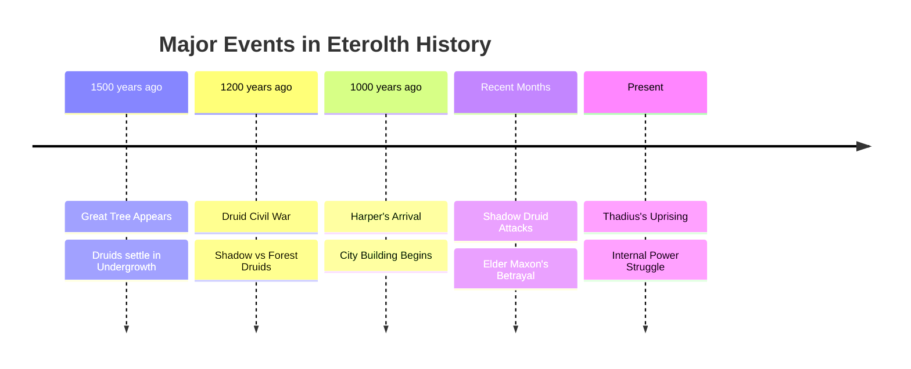
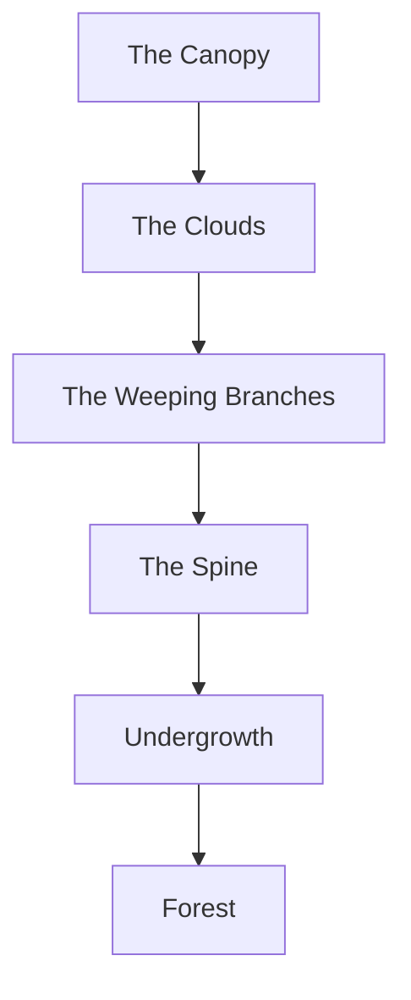
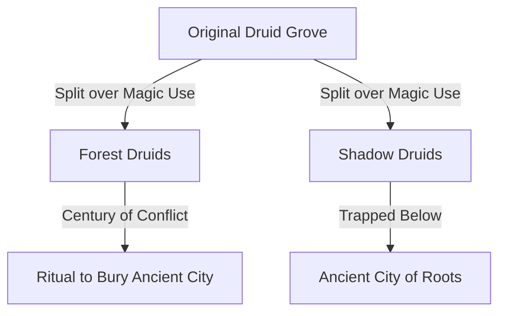
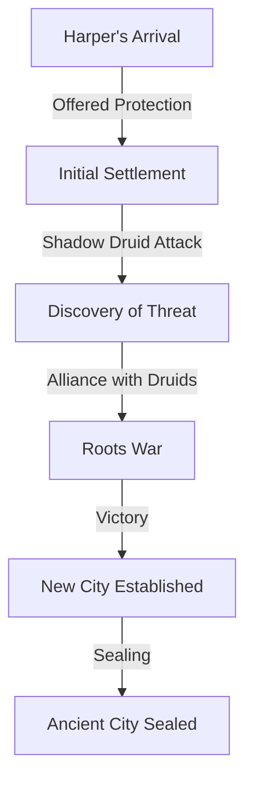
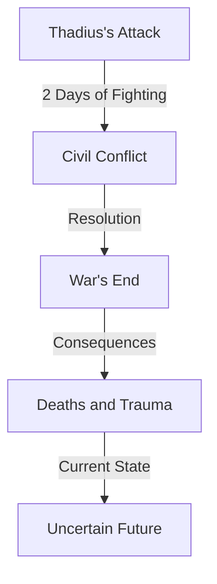

# The History of Eterolth and the Great Tree

## Synopsis
This document chronicles the complete history of Eterolth and the Great Tree, from its mysterious appearance 1,500 years ago to the present day political struggles. It serves as the foundational historical record for the setting, detailing major conflicts, societal changes, and the evolution of power structures within the Great Tree.

## Quick Navigation
- [[## The Great Tree's Origin (≈1500 Years Ago)]]
- [[#The Great Tree Structure]]
- [[#The First Civil War (≈1200 Years Ago)]]
- [[#Harper's Era (≈1000 Years Ago)]]
- [[#Recent Events]]
- [[#Current State of Eterolth]]

## Timeline Overview

## The Great Tree's Origin (≈1500 Years Ago)

> [!info] Major Historical Event
> **The Great Tree's Appearance**  
> **Date:** ~1500 years ago  
> **Impact:** Established the foundation for all current civilization  
> **Key Consequences:** Formation of the Druid Grove, attraction of magical beings  
> **Connected Events:** Initial settlement patterns, establishment of magical focal point

A massive tree mysteriously appeared, becoming a focal point of magical energy and civilization. The initial settlers included the Druid Grove, various magical creatures, Fey beings, and even a consortium of hags. This diverse collection of beings would lay the groundwork for the complex society that would eventually emerge within the Great Tree's bounds.

## The Great Tree Structure

### Early Settlement Characteristics
The Undergrowth became home to various magical beings, all drawn to the tree's inherent magical properties. This period marked the beginning of what would become a complex society within and around the Great Tree, establishing patterns of habitation that would influence the development of distinct districts and social hierarchies.

## The First Civil War (≈1200 Years Ago)

> [!warning] Major Conflict
> **The Druid Schism**  
> **Duration:** Approximately 100 years  
> **Primary Factions:** Forest Druids vs Shadow Druids  
> **Resolution:** Ritual burial of the Ancient City  
> **Long-term Impact:** Creation of the Ancient City of Roots

### Key Events
1. **Cause:** Fundamental dispute over the nature of magic found in tree roots
2. **Duration:** Approximately 100 years of sustained conflict
3. **Resolution:** Forest Druids performed a powerful ritual to bury the old civilization
4. **Aftermath:** Shadow Druids became trapped in the deep roots, creating a lasting division

## Harper's Era (≈1000 Years Ago)

> [!info] Historical Period
> **Harper's Arrival**  
> **Major Changes:** Establishment of formal city structures  
> **Key Developments:** Alliance with Forest Druids, defeat of dark magic users  
> **Legacy:** Modern city layout and governance structure

### The Roots War
- **Catalyst:** Shadow Druid attack on Harper's guards
- **Agreement:** Harper promised to eliminate dark magic users
- **Outcome:** Successful purge of dark magic practitioners and hag coven
- **Legacy:** Creation of secret Ancient City of Roots

## Recent Events

### Shadow Druid Resurgence
> [!danger] Current Crisis
> **Ongoing Threat**  
> **Major Developments:**  
> - Attacks on farmlands  
> - Elder Maxon's betrayal revealed  
> - Grove split into factions  
> - Kirrian's ascension to leadership

### Winter's Aftermath
The recent winter has left lasting scars on Eterolth, manifesting in:
- Blighted farmlands reducing food production
- Widespread food shortages affecting all districts
- Increased Adventurers Guild activity to combat threats
- Lingering effects of Shadow Druid conflicts

### Thadius's Uprising

## Current State of Eterolth

> [!note] Present Day
> **Major Challenges:**  
> - Political instability following Thadius's uprising  
> - Recovery from multiple conflicts  
> - Food scarcity from winter and blight  
> - Increased guard presence  
> - Active Adventurers Guild operations

The city finds itself at a crucial juncture, dealing with the aftermath of recent upheavals while trying to maintain stability and prepare for future challenges. The interplay between various factions continues to shape the political landscape, while the everyday citizens cope with the practical consequences of recent events.

---