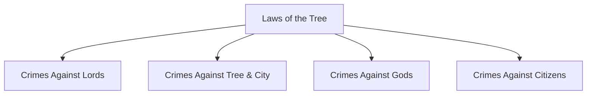
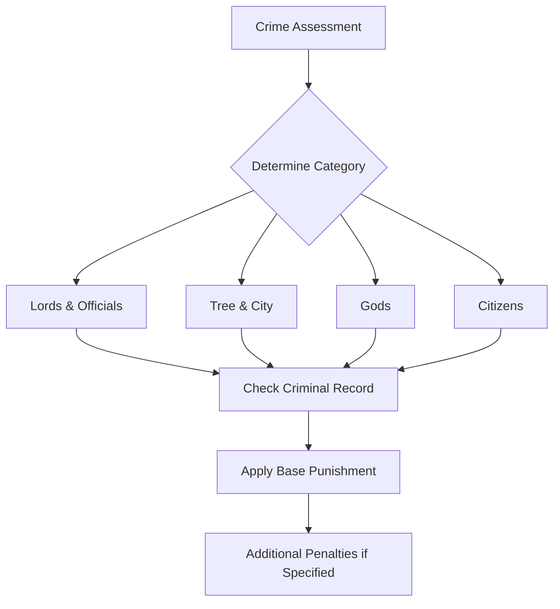

---
tags:
  - laws
  - legal_system
  - punishment
  - crimes
  - governance
aliases:
  - Criminal Code
  - Legal Framework
  - Laws of Etorolth
type: legal_document
date: 2024-12-25
---
---
# The Laws of the Tree

## Fundamental Punishment Framework

The following punishments may be applied based on:
- Nature of the crime
- Who or what the crime is committed against
- Criminal record of the convicted

| Base Punishment Types | Description | Default if Unable to Pay |
|---------------------|-------------|------------------------|
| Death | Capital punishment | N/A |
| Banishment | Exile from territory | N/A |
| Imprisonment | Days/weeks/months based on crime severity | N/A |
| Fine | Payable to the city | Imprisonment |
| Damages | Payable to injured party/kin | Imprisonment |

## I. Crimes against Lords, Officials, and Nobles

| Crime | Primary Punishment | Secondary Punishment | Tertiary Punishment |
|-------|-------------------|---------------------|-------------------|
| Assaulting/impersonating Lord | Death | - | - |
| Assaulting/impersonating official/noble | Flogging | Imprisonment up to 1 week | Fine up to 500 gp |
| Blackmailing official | Imprisonment up to 10 years | - | - |
| Bribery of official | Exile up to 20 years | Fine up to 2x bribe | - |
| Murder of Lord/official/noble | Death | - | - |
| Magical influence on Lord | Imprisonment up to 1 year | Fine/damages up to 1,000 gp | - |
| Magical influence on official | Imprisonment up to 6 months | Fine up to 1,000 gp | - |

## II. Crimes against the Tree & City

| Crime | Primary Punishment | Secondary Punishment |
|-------|-------------------|---------------------|
| Arson | Death/imprisonment up to 1 year | Fines for repairs + 2,000 gp |
| Brandishing weapons | Imprisonment up to 1 week | Fine up to 10 gp |
| Espionage | Death or banishment | - |
| Fencing stolen goods | Fine equal to goods value | - |
| Forgery | Imprisonment up to 1 month | - |
| Hampering justice | Fine up to 200 gp | Imprisonment up to 1 week |
| Littering | Fine up to 2 gp | - |
| Poisoning well | Death | - |
| Theft | Imprisonment up to 1 week | Fine equal to goods value |
| Treason | Death | - |
| Vandalism | Imprisonment up to 1 week | Fine for repairs + 100 gp |

## III. Crimes against the Gods

| Crime | Primary Punishment | Secondary Punishment |
|-------|-------------------|---------------------|
| Assaulting priest/worshiper | Imprisonment up to 1 year | Damages up to 500 gp |
| Temple disorder | Fine up to 5 gp | - |
| Temple theft | Imprisonment up to 1 week | Double damages of stolen items |
| Tomb-robbing | Imprisonment up to 1 month | Repair costs + 500 gp |

## IV. Crimes against Citizens

| Crime | Primary Punishment | Secondary Punishment | Tertiary Punishment |
|-------|-------------------|---------------------|-------------------|
| Assault | Imprisonment up to 1 month | Flogging | Damages up to 1,000 gp |
| Blackmail/intimidation | Fine/damages up to 500 gp | Edict | - |
| Burglary | Imprisonment up to 3 months | Fine = goods value + 500 gp | - |
| Property damage | Fine for repairs/replacement + 500 gp | - | - |
| Disturbing peace | Fine up to 25 gp | - | - |
| Murder without justification | Death/imprisonment up to 10 years | Damages up to 1,000 gp to kin | - |
| Murder with justification | Exile 5 years/imprisonment 3 years | Fine up to 1,000 gp to kin | - |
| Robbery | Imprisonment up to 1 month | Fine = goods value + 500 gp | - |
| Slavery | Imprisonment up to 10 years | - | - |
| Magical influence | Fine up to 1,000 gp | Imprisonment up to 6 months | - |

---