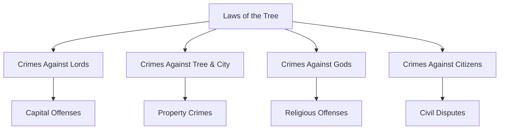
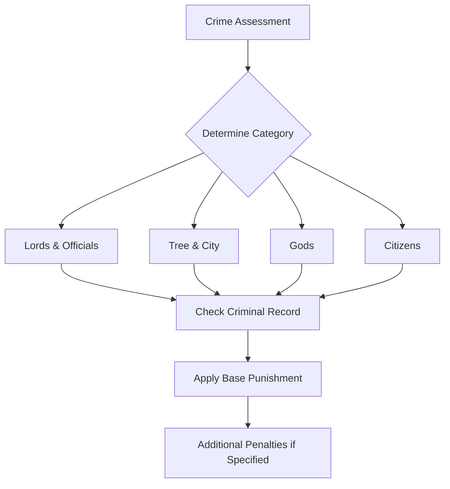

# The Laws of the Tree

## Synopsis
This document codifies the legal framework of Eterolth, establishing the hierarchy of crimes and their corresponding punishments. It serves as the primary reference for law enforcement, judicial proceedings, and citizen conduct within the jurisdiction of the Great Tree.

## Quick Navigation
- [[#Fundamental Punishment Framework]]
- [[## I. Crimes against Lords, Officials, and Nobles]]
- [[## II. Crimes against the Tree & City]]
- [[## III. Crimes against the Gods]]
- [[## IV. Crimes against Citizens]]

## Legal Structure Overview

## Fundamental Punishment Framework

> [!important] Legal Principles
> Punishment severity is determined by three primary factors:
> 1. The nature and severity of the crime
> 2. The status of the victim or target
> 3. The perpetrator's criminal history

The judicial system employs the following base punishments, applied according to the severity and circumstances of each crime:

| Base Punishment Types | Description | Default if Unable to Pay |
|---------------------|-------------|------------------------|
| Death | Capital punishment for the most severe crimes | N/A |
| Banishment | Permanent or temporary exile from Eterolth's territory | N/A |
| Imprisonment | Confinement ranging from days to years based on severity | N/A |
| Fine | Monetary compensation to the city treasury | Imprisonment |
| Damages | Monetary compensation to victims or their families | Imprisonment |

## I. Crimes against Lords, Officials, and Nobles

> [!warning] Severity Level: Maximum
> Crimes against the leadership of Eterolth carry the harshest penalties, reflecting the gravity of challenging established authority.

| Crime | Primary Punishment | Secondary Punishment | Tertiary Punishment |
|-------|-------------------|---------------------|-------------------|
| Assaulting/impersonating Lord | Death | - | - |
| Assaulting/impersonating official/noble | Flogging | Imprisonment up to 1 week | Fine up to 500 gp |
| Blackmailing official | Imprisonment up to 10 years | - | - |
| Bribery of official | Exile up to 20 years | Fine up to 2x bribe | - |
| Murder of Lord/official/noble | Death | - | - |
| Magical influence on Lord | Imprisonment up to 1 year | Fine/damages up to 1,000 gp | - |
| Magical influence on official | Imprisonment up to 6 months | Fine up to 1,000 gp | - |

## II. Crimes against the Tree & City

> [!warning] Protected Heritage
> The Great Tree and city infrastructure are considered sacred. Crimes against these entities represent attacks on the community's foundation.

| Crime | Primary Punishment | Secondary Punishment |
|-------|-------------------|---------------------|
| Arson | Death/imprisonment up to 1 year | Fines for repairs + 2,000 gp |
| Brandishing weapons | Imprisonment up to 1 week | Fine up to 10 gp |
| Espionage | Death or banishment | - |
| Fencing stolen goods | Fine equal to goods value | - |
| Forgery | Imprisonment up to 1 month | - |
| Hampering justice | Fine up to 200 gp | Imprisonment up to 1 week |
| Littering | Fine up to 2 gp | - |
| Poisoning well | Death | - |
| Theft | Imprisonment up to 1 week | Fine equal to goods value |
| Treason | Death | - |
| Vandalism | Imprisonment up to 1 week | Fine for repairs + 100 gp |

## III. Crimes against the Gods

> [!note] Divine Protection
> Religious offenses are treated with particular gravity, recognizing the fundamental role of faith in Eterolth's society.

| Crime | Primary Punishment | Secondary Punishment |
|-------|-------------------|---------------------|
| Assaulting priest/worshiper | Imprisonment up to 1 year | Damages up to 500 gp |
| Temple disorder | Fine up to 5 gp | - |
| Temple theft | Imprisonment up to 1 week | Double damages of stolen items |
| Tomb-robbing | Imprisonment up to 1 month | Repair costs + 500 gp |

## IV. Crimes against Citizens

> [!note] Civil Protection
> These laws ensure the safety and rights of Eterolth's general population, maintaining social order and justice.

| Crime | Primary Punishment | Secondary Punishment | Tertiary Punishment |
|-------|-------------------|---------------------|-------------------|
| Assault | Imprisonment up to 1 month | Flogging | Damages up to 1,000 gp |
| Blackmail/intimidation | Fine/damages up to 500 gp | Edict | - |
| Burglary | Imprisonment up to 3 months | Fine = goods value + 500 gp | - |
| Property damage | Fine for repairs/replacement + 500 gp | - | - |
| Disturbing peace | Fine up to 25 gp | - | - |
| Murder without justification | Death/imprisonment up to 10 years | Damages up to 1,000 gp to kin | - |
| Murder with justification | Exile 5 years/imprisonment 3 years | Fine up to 1,000 gp to kin | - |
| Robbery | Imprisonment up to 1 month | Fine = goods value + 500 gp | - |
| Slavery | Imprisonment up to 10 years | - | - |
| Magical influence | Fine up to 1,000 gp | Imprisonment up to 6 months | - |

## Enforcement Process

## Implementation Notes

The enforcement of these laws falls under the jurisdiction of the City Guard, with oversight from appointed magistrates. Modifications to these laws require approval from the City Council and must be publicly proclaimed before taking effect.

> [!important] Legal Authority
> These laws derive their authority from the established governance of Eterolth and are enforced throughout all districts of the Great Tree. Appeals may be made to the City Council in cases of disputed interpretation or application.

---