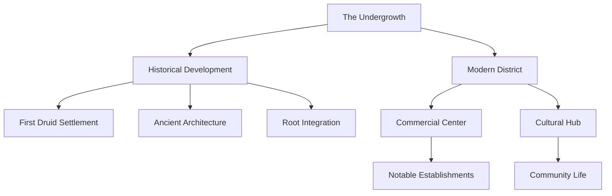

# The Undergrowth District

## Synopsis
The Undergrowth represents Eterolth's foundational district, both literally and historically. As the city's oldest and lowest section, it exemplifies the seamless integration between the Great Tree's massive root system and generations of urban development. This district embodies the living history of Eterolth, where ancient structures have become one with the tree's root network over centuries of coexistence.

## Quick Navigation
- [[#Historical Significance]]
- [[#District Geography]]
- [[#Notable Establishments]]
- [[#Architectural Features]]
- [[#Daily Life]]
- [[#Cultural Significance]]

## Historical Significance

> [!info] Historical Origins
> The Undergrowth holds the distinction of being Eterolth's original settlement, established during the Great Tree's mysterious appearance approximately 1,500 years ago. This district served as the foundation for what would become one of the most unique urban developments in the realm.

The historical development of the Undergrowth can be traced through distinct periods, each leaving its mark on the district's character. The original Druid Grove established their first settlement here, laying the groundwork for the unique architectural style that would develop over centuries of coexistence with the Great Tree.

## District Geography

The Undergrowth occupies the lowest level of Eterolth, nestled among the Great Tree's massive root system. This positioning creates a unique environment where natural and constructed elements have become inextricably linked over centuries. The district's layout follows the natural pathways created by the tree's root structure, resulting in an organic urban design that defies conventional city planning.

## Notable Establishments

### The Bitter Cure
This establishment stands as Eterolth's premier potion shop, serving multiple vital functions within the community:

> [!note] Key Features
> - Primary source for healing potions and remedies
> - Training facility for Court healers
> - Repository of ancient healing knowledge
> - Founded and operated by Melody
> - Essential supplier for the city's medical needs

### The Songbird's Flame
A cornerstone of community life, this tavern represents more than just a place for food and drink. Under the management of Zarrias and Wicker, it has evolved into a cultural institution that provides:

> [!note] Services and Atmosphere
> The establishment combines several essential functions:
> - Community gathering space
> - Performance venue for local and traveling musicians
> - Quality lodging for visitors
> - Culinary destination featuring both local and exotic cuisine
> - Information hub for district news and developments

### Commercial Infrastructure
The district maintains a robust commercial presence through various establishments:

The Junk Shop serves as a marketplace for secondhand goods, where resourceful residents can find unexpected treasures among previously owned items. This establishment plays a crucial role in the district's circular economy, promoting resource reuse and providing affordable alternatives for necessary items.

The General Store provides essential daily supplies to residents, ensuring access to basic necessities without requiring travel to upper districts. This establishment helps maintain the Undergrowth's self-sufficiency and serves as a community hub where neighbors regularly cross paths.

## Architectural Features

The Undergrowth's architecture reflects centuries of adaptation to its unique environment:

> [!important] Structural Characteristics
> The district's buildings demonstrate several distinctive features:
> - Extensive moss growth that has become an integral part of building aesthetics
> - Natural integration with the Great Tree's root system
> - Visible ancient construction techniques in foundational structures
> - Organic fusion between built and natural elements
> - Adaptive design that accommodates root growth and movement

The architecture of the Undergrowth tells the story of generations adapting to life beneath the Great Tree. Buildings have evolved over time, with newer constructions learning from and building upon ancient techniques for working with the living root system.

## Daily Life

The rhythm of life in the Undergrowth reflects its position as both an ancient district and a vital commercial center. Residents navigate the moss-covered pathways between root-embraced buildings, conducting their daily business in spaces where history is literally built into the walls. The district maintains a strong sense of community, fostered by shared spaces like The Songbird's Flame and the various commercial establishments that serve as gathering points.

## Cultural Significance

The Undergrowth stands as a living testament to Eterolth's history and resilience. Its continued vitality as both a residential and commercial district, despite being the oldest part of the city, demonstrates the successful integration of progress with tradition. The district serves as a reminder of the city's origins while maintaining its relevance in contemporary urban life.

---

*Note: This district exemplifies the enduring relationship between the people of Eterolth and the Great Tree, where ancient history remains alive in the daily experience of its residents.*