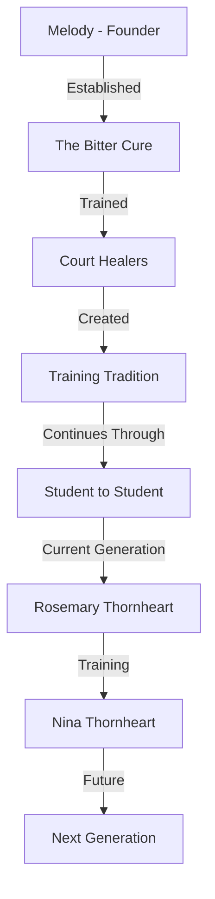

# The Bitter Cure

## Synopsis
The Bitter Cure represents more than just Etorolth's premier potion shop; it stands as a living institution of healing knowledge and education. Located in the historic Undergrowth district, this establishment combines commercial potion-making with the vital role of training the next generation of healers for both the city and the Court.

## Quick Navigation
- [[#Physical Description]]
- [[#Business Operations]]
- [[#Educational Services]]
- [[#Key Personnel]]
- [[#Products and Services]]
- [[#Historical Significance]]

## Physical Description

The shop occupies a traditional Undergrowth building, where centuries of integration with the Great Tree's roots have created a unique architecture perfectly suited for herb cultivation and potion brewing. The structure features:

> [!note] Architectural Features
> The establishment consists of several distinct areas:
> - Main Shop Floor: Open to the public, displaying ready-made potions
> - Brewing Laboratory: Where potions are crafted and tested
> - Training Hall: Dedicated space for apprentice education
> - Herb Garden: Carefully maintained growing space between root structures
> - Emergency Treatment Room: For immediate care needs
> - Living Quarters: Private residence for owner and apprentice

The building's integration with the tree roots has created natural storage spaces that maintain perfect conditions for ingredient preservation, while moss-covered exterior walls help regulate interior temperature for optimal potion brewing conditions.

## Business Operations

### Daily Operations
The establishment maintains regular business hours from dawn to dusk, though emergency services remain available at all hours. The shop operates on a structured schedule that balances commercial activities with educational responsibilities:

> [!important] Operating Schedule
> Morning: Potion brewing and inventory management
> Midday: Open shop hours and general sales
> Afternoon: Apprentice training and specialized order fulfillment
> Evening: Research and documentation
> Emergency services available at all hours

## Key Personnel

### Rosemary Thornheart (Current Owner)
The current proprietor continues Melody's legacy while adding her own innovations to both the business and educational aspects of the establishment. Her expertise includes:

> [!note] Proprietor Specialties
> - Advanced potion crafting
> - Emergency medical treatment
> - Traditional healing methods
> - Modern medical research
> - Educational methodology

### Nina Thornheart (Apprentice)
Rosemary's niece and current apprentice represents the next generation of the establishment's leadership. Her training encompasses:
- Comprehensive potion brewing techniques
- Business management principles
- Medical knowledge and healing arts
- Traditional and modern healing methods
- Customer service and community relations

## Products and Services

The establishment offers a comprehensive range of healing-related products and services:

### Potions and Remedies
The shop maintains a diverse inventory of healing preparations:
- Standard healing potions of various strengths
- Specialized treatment solutions
- Preventative tonics
- Emergency medical supplies
- Custom-brewed remedies for specific conditions

### Educational Services
As a training institution, The Bitter Cure provides:
- Apprenticeship programs
- Court healer certification
- Advanced brewing techniques
- Medical knowledge preservation
- Research opportunities

## Historical Significance

> [!info] Historical Timeline
> The establishment's history reflects the development of healing arts in Etorolth:
> - Founded by Melody in the early days of the city
> - Established the tradition of Court healer training
> - Developed standardized potion-making techniques
> - Created the current apprenticeship system
> - Maintained continuous operation through various crises

## Community Role

The Bitter Cure serves multiple vital functions within Etorolth's society:
- Primary source for healing potions and remedies
- Emergency medical treatment center
- Training facility for healers
- Repository of medical knowledge
- Community health resource
- Court medical supplier

## Future Prospects

Under the current leadership transition from Rosemary to Nina Thornheart, The Bitter Cure continues to evolve while maintaining its essential traditions. Plans for the future include:
- Expansion of training programs
- Integration of new healing techniques
- Enhanced emergency response capabilities
- Broader community health initiatives
- Preservation of traditional knowledge

---

*Note: The Bitter Cure stands as a testament to Etorolth's commitment to healing arts and education, combining commercial success with vital community service.*