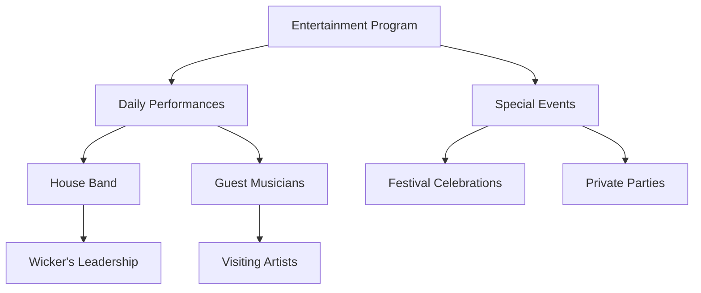

# The Songbird's Flame

## Synopsis
The Songbird's Flame represents the beating heart of the Undergrowth's social life. This beloved establishment combines the warmth of a traditional tavern with the cultural richness of a performance venue, all under the careful stewardship of its charismatic owners, Zarrias and Wicker. Their complementary management styles and obvious affection for each other have created an atmosphere that makes every visitor feel like part of an extended family.

## Physical Description
The tavern occupies a traditional Undergrowth building where centuries of integration with the Great Tree's roots have created unique architectural features that enhance its charm. The establishment consists of several distinct areas:

> [!note] Venue Layout
> The tavern features multiple spaces designed for different purposes:
> - Main Dining Hall: Open space with a central performance area
> - Private Dining Alcoves: Naturally formed by root structures
> - Comfortable Bar: Featuring a root-carved counter
> - Guest Rooms: Upper level accommodations
> - Kitchen: Modern facilities in a traditional setting
> - Storage Cellar: Natural cool storage within root cavities

## Proprietors

### Zarrias and Wicker
The tavern's success stems from the perfect partnership of its owners:

> [!info] Management Team
> **Zarrias:**
> - Manages daily operations
> - Oversees staff and service quality
> - Handles business administration
> - Creates welcoming atmosphere
> 
> **Wicker:**
> - Leads house band
> - Schedules entertainment
> - Maintains musical equipment
> - Fosters artistic community

Their relationship adds a special charm to the establishment, with their obvious affection for each other creating a romantic atmosphere that patrons find endearing.

## Accommodations

The tavern offers comfortable lodging options suitable for various durations:

### Room Rates and Amenities

| Duration | Cost | Amenities Included |
|----------|------|-------------------|
| Per Night | 5 silver pieces | Fresh linens, daily cleaning, breakfast |
| Monthly | 15 gold pieces | Weekly cleaning, meal discounts, storage space |

> [!note] Room Features
> Each room provides:
> - Comfortable bedding
> - Personal storage
> - Natural lighting
> - Root-integrated architecture
> - Access to common areas

## Dining Experience

The tavern offers an extensive menu featuring both local specialties and exotic dishes, served throughout the day in a warm, welcoming atmosphere.

### Breakfast Offerings
Start your day with hearty morning fare:

| Dish | Price | Description |
|------|-------|-------------|
| Roasted Locusts | 1 copper | Traditional Undergrowth protein-rich starter |
| Cheese Omelet | 4 copper | Made with local eggs and aged cheese |
| Ham & Cheese on Rye | 6 copper | Classic breakfast sandwich |
| Dragon's Eggs* | 8 copper | Signature spicy egg dish |

*Dragon's Eggs represents the tavern's creative approach to traditional ingredients, combining local eggs with exotic spices and artistic presentation.

### Lunch Selection
Midday offerings feature innovative combinations of local and exotic ingredients:

| Dish | Price | Description |
|------|-------|-------------|
| Braised Porcupine | 1 silver | Served with salty cashew sauce and edam cheese |
| Deer Mouse Porridge | 5 silver | Accompanied by steamed corn and potato bread |
| Gnoll Chunks | 7 silver | Features red pepper sauce and pumpernickel bread |
| Sabre-Toothed Tiger Kidneys | 8 silver | Sautéed in sweet cilantro vinaigrette |

### Dinner Specialties
Evening meals showcase the kitchen's finest culinary achievements:

| Dish | Price | Description |
|------|-------|-------------|
| Stewed Hydra | 1 gold | Served in mustard sauce with white bread |
| Peryton Broth | 3 gold | Includes steamed chickpeas and cornbread baguette |
| Couatl Tripe | 2 gold | Prepared in sharp red sauce |
| Breaded Chimera | 4 gold | Features smooth red sauce and swiss cheese |

### Desserts
Sweet endings to complement any meal:

| Dish | Price | Special Notes |
|------|-------|--------------|
| Peach Crumble | 5 silver | Seasonal favorite |
| Black Banana Puddings | 1 gold | House specialty |
| Honey Fruit Salad | 5 copper | Light refreshing option |
| Passion Fruit Cookies | 2 gold | Wicker's personal recipe |

## Entertainment

The tavern's entertainment program, led by Wicker, provides a rich variety of musical performances that enhance the dining experience and create a vibrant social atmosphere.

### Regular Performances
Evening entertainment features:
- Wicker's house band performances
- Local musician showcases
- Traditional song nights
- Guest artist appearances
- Seasonal celebrations

## Community Role

The Songbird's Flame serves as more than just a tavern; it functions as a crucial community gathering space where:
- Local news and gossip are exchanged
- Celebrations are hosted
- Business deals are struck
- Friendships are forged
- Cultural traditions are maintained

## Guest Services

The establishment maintains high standards of hospitality through:
- Attentive staff service
- Flexible accommodation options
- Special event hosting
- Custom meal preparations
- Local information sharing

---

*Note: The Songbird's Flame exemplifies the best of Undergrowth hospitality, where good food, warm company, and delightful entertainment create an unforgettable tavern experience.*