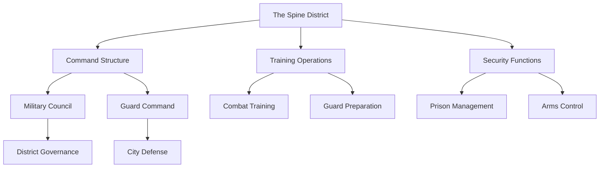

# The Spine District

## Synopsis
The Spine District serves as the martial backbone of Eterolth, housing the city's primary military and law enforcement facilities. This district embodies the disciplined heart of the city's defense forces, where the sound of training and the presence of armed personnel create an atmosphere of unwavering vigilance and martial dedication.

## Quick Navigation
- [[#District Overview]]
- [[#Military Infrastructure]]
- [[#Notable Locations]]
- [[#Daily Operations]]
- [[#Security Protocols]]
- [[#District Culture]]

## District Overview

The Spine occupies a strategic position within Eterolth's vertical hierarchy, positioned to respond swiftly to threats from any level of the Great Tree. Its location represents a careful balance between accessibility for security operations and defensibility in times of crisis.

## Military Infrastructure

The district's design prioritizes efficiency and security, with every architectural element serving a practical defensive purpose. The integration of military facilities within the Great Tree's natural structure creates a formidable defensive position that capitalizes on the unique advantages of elevated warfare.

### Command Structure

> [!important] Chain of Command
> The district operates under a strict hierarchical system:
> - Military Council: Strategic oversight
> - Guard Command: Tactical operations
> - Training Command: Combat preparation
> - Prison Authority: Detention management
> - Arms Control: Weapon regulation

## Notable Locations

### The Weaponry Shop
The sole authorized arms merchant in Eterolth operates under strict military oversight. This monopoly on martial equipment ensures:
- Quality control of all weapons
- Regulated distribution of arms
- Maintenance of security standards
- Strategic control of martial resources
- Proper training requirements

### The Training Yard
The district's central facility for military preparation features:
- Multiple training areas for different combat styles
- Archery ranges integrated into tree structures
- Magical combat practice zones
- Drill grounds for formation training
- Specialized equipment storage
- Medical treatment station

### The Prison
This secure facility represents the final consequence of Eterolth's justice system. The prison's design incorporates:
- Multiple security levels
- Natural root-reinforced cells
- Magical containment areas
- Rehabilitation facilities
- Guard stations
- Visitor processing center

## Daily Operations

The district maintains a precise schedule that reflects its military nature:

> [!note] Daily Routine
> Dawn: Shift change and morning drills
> Morning: Combat training and weapons practice
> Midday: Administrative duties and patrol rotations
> Afternoon: Specialized training and guard deployment
> Evening: Security checks and night watch preparation
> Night: Enhanced surveillance and reduced personnel

## Security Protocols

The Spine maintains stringent security measures that affect all aspects of daily life:

### Access Control
- Identification requirements for all visitors
- Restricted areas for military personnel only
- Scheduled civilian access periods
- Escort requirements for non-military personnel
- Emergency lockdown procedures

### Arms Regulation
- Strict weapon carrying permissions
- Required registration of all combat equipment
- Regular inspections of authorized weapons
- Training requirements for weapon possession
- Controlled distribution of military supplies

## District Culture

The Spine's atmosphere reflects its role as Eterolth's military center. The culture emphasizes:

### Professional Environment
The district maintains an atmosphere of:
- Martial discipline
- Structured interactions
- Clear chain of command
- Professional courtesy
- Minimal frivolity

### Resident Life
Military personnel residing in the district experience:
- Communal living arrangements
- Structured daily routines
- Regular training requirements
- Limited recreational activities
- Strong unit cohesion

## Historical Context

The district's development parallels Eterolth's growing need for organized defense:
- Establishment during early military organization
- Evolution of training methodologies
- Adaptation to emerging threats
- Integration of magical and conventional warfare
- Development of current security protocols

## Relationship with Other Districts

The Spine maintains careful relationships with other districts:
- Reports to: The Clouds (administrative oversight)
- Protects: All districts (security operations)
- Coordinates with: The Canopy (royal protection)
- Monitors: The Undergrowth (crime prevention)
- Supports: The Weeping Branches (event security)

## Current Status

The district operates at high efficiency, maintaining Eterolth's security through:
- Active training programs
- Regular patrol schedules
- Ongoing threat assessment
- Coordinated defense planning
- Strategic resource management

---

*Note: The Spine District stands as the guardian of Eterolth's peace, where military precision and unwavering vigilance ensure the city's continued security.*