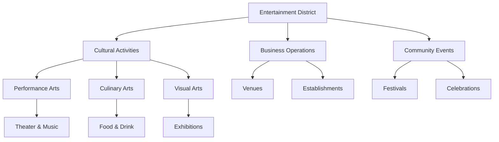
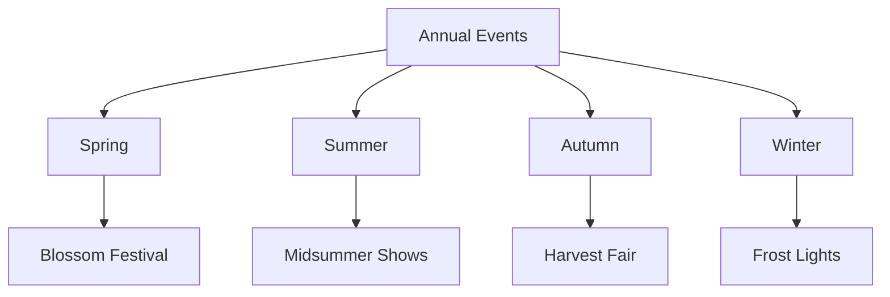

# The Entertainment District

## Synopsis
The Entertainment District, nestled within the Weeping Branches of the Great Tree, serves as Eterolth's vibrant cultural center. This district celebrates the performing arts, culinary creativity, and communal joy, offering a diverse array of entertainment options that attract visitors from every level of the Great Tree.

## Quick Navigation
- [[#District Overview]]
- [[#Performance Venues]]
- [[#Culinary Establishments]]
- [[#Cultural Events]]
- [[#District Life]]
- [[#Seasonal Celebrations]]

## District Overview

## Performance Venues

### The Grand Theatre
The crown jewel of Eterolth's performing arts scene features:

> [!note] Theatre Features
> - Main Stage: 300-seat capacity
> - Experimental Space: 50-seat intimate venue
> - Rehearsal Halls: Multiple practice spaces
> - Costume Workshop: Full design facilities
> - Props Storage: Extensive collection
> - Student Training Area: Educational space

Regular productions include:
- Classical dramas
- Musical performances
- Dance exhibitions
- Magical displays
- Poetry readings

### Willows Performance Hall
A versatile venue catering to diverse artistic expressions:

> [!note] Willows Highlights
> - Multiple performance spaces
> - Bardic training facilities
> - Open mic opportunities
> - Student workshops
> - Collaborative areas
> - Recording rooms

Special Programs:
- New artist showcases
- Bardic competitions
- Music masterclasses
- Cultural exchanges
- Community performances

## Culinary Establishments

### The Morning Glory Bakery
This beloved establishment fills the district with irresistible aromas:

> [!important] Bakery Specialties
> - Fresh daily bread
> - Seasonal pastries
> - Special occasion cakes
> - Savory treats
> - Cultural delicacies
> - Dietary accommodations

### Fairy Orb Confectionery
A magical destination for sweet enthusiasts:

> [!note] Sweet Offerings
> - Handcrafted candies
> - Magical confections
> - Special effect treats
> - Seasonal specialties
> - Custom creations
> - Gift arrangements

## Cultural Programming

The district maintains a rich calendar of events throughout the year:

### Regular Events
- Daily street performances
- Weekly theater productions
- Monthly art exhibitions
- Seasonal festivals
- Cultural celebrations
- Educational workshops

### Special Occasions

## District Atmosphere

The Entertainment District cultivates an environment where creativity and joy flourish naturally:

### Day Life
- Morning bakery rushes
- Afternoon performances
- Street entertainers
- Arts classes
- Casual gatherings
- Cultural tours

### Night Life
- Evening shows
- Musical performances
- Moonlight markets
- Social gatherings
- Special events
- Artistic collaborations

## Community Engagement

The district actively promotes participation in cultural life:

### Educational Initiatives
- Performance workshops
- Culinary classes
- Art instruction
- Cultural education
- Creative mentoring
- Youth programs

### Public Spaces
- Artists' Square
- Performance Gardens
- Practice Areas
- Exhibition Spaces
- Gathering Places
- Creative Corners

## Economic Impact

The district contributes significantly to Eterolth's economy through:
- Ticket sales
- Cultural tourism
- Artisan commerce
- Culinary sales
- Educational programs
- Festival revenue

## Relationship with Other Districts

The Entertainment District maintains beneficial connections throughout Eterolth:
- Provides entertainment for The Clouds nobility
- Coordinates security with The Spine
- Sources ingredients from The Undergrowth
- Performs for The Canopy's special events
- Trains performers from all districts

## Current Trends

The district continually evolves to meet changing tastes:
- Integration of traditional and modern arts
- Cross-cultural performances
- Innovative culinary experiences
- Interactive entertainment options
- Digital art incorporation
- Sustainable practices

*Note: The Entertainment District embodies Eterolth's creative spirit, where every visit promises new experiences and every performance celebrates the city's rich cultural life.*