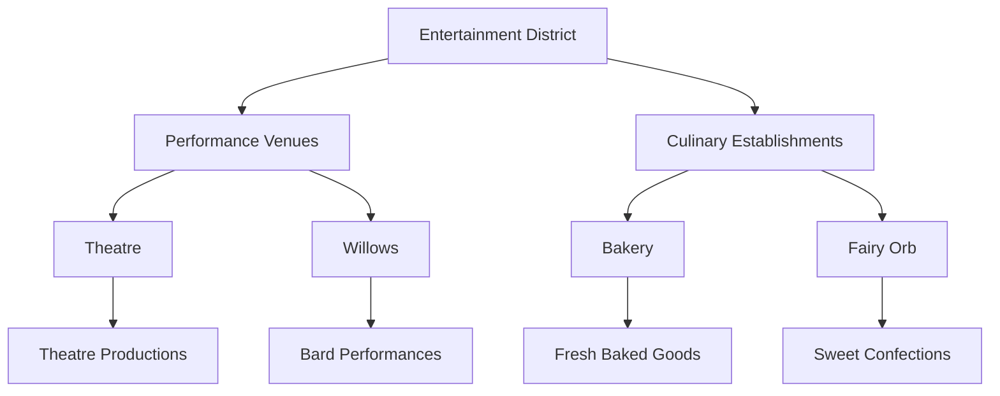

---
tags:
  - location
  - district
  - entertainment
  - etorolth
  - culture
aliases:
  - Entertainment Quarter
  - Cultural District
  - Leisure District
type: district
location: Etorolth
date: 2024-12-25
---

# The Entertainment District

The Entertainment District pulses with the vibrant heartbeat of Etorolth's cultural life, offering diversions and delights for every taste. This district stands as a testament to the city's appreciation for both performing arts and culinary pleasures, creating an atmosphere where creativity and joy flourish in equal measure.

## Performance Venues

### The Theatre
The district's theatrical heart provides regular entertainment for Etorolth's residents and visitors alike. Here, stories come to life on stage, offering cultural enrichment through dramatic performances that captivate audiences throughout the year.

### Willows
This establishment serves as a welcoming venue for performers of all kinds, with a particular emphasis on bardic arts. Aspiring performers and seasoned bards alike can find their stage here, making it a crucial stepping stone for those seeking to share their talents with appreciative audiences.

## Culinary Delights

### The Bakery
Fresh baked goods emerge daily from this establishment, filling the district's streets with enticing aromas that draw visitors from throughout Etorolth. The bakery stands as a cornerstone of the district's culinary offerings, providing sustenance and satisfaction to all who visit.

### Fairy Orb
This specialty establishment caters to those with a fondness for sweeter fare, offering confections and treats that satisfy the most discerning sweet tooth. The Fairy Orb has established itself as a destination for those seeking sugary delights within the Great Tree.

## District Atmosphere

The Entertainment District maintains a perpetual festival-like atmosphere, where the lines between performer and audience often blur. The intermingling of theatrical productions, musical performances, and culinary arts creates an environment where there is truly always something happening to engage and delight visitors.

The district encourages participation as much as observation, welcoming those who wish to transition from audience to performer. This open invitation to engagement helps maintain the district's vibrant, dynamic character, ensuring that entertainment in Etorolth remains a living, evolving art form rather than merely a passive experience.

---

*Note: Whether seeking cultural enrichment through theatrical performances, an opportunity to showcase artistic talents, or simply a sweet treat to brighten the day, the Entertainment District stands ready to fulfill these desires for all who visit.*