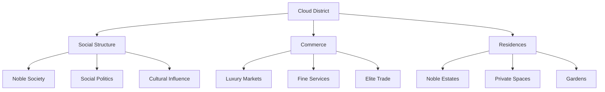
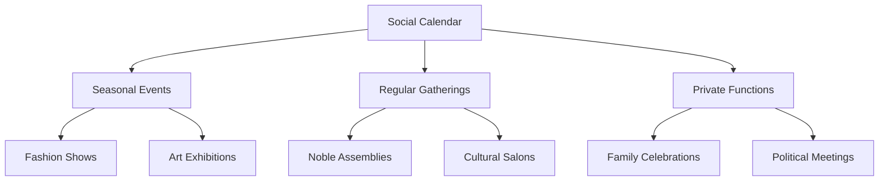

# The Cloud District

## Synopsis
The Cloud District represents the pinnacle of Eterolth's social and commercial achievement, second only to the Canopy in prestige. This district embodies refinement and privilege, serving as home to the city's nobility while providing the finest goods and services available within the Great Tree.

## Quick Navigation
- [[#District Overview]]
- [[#Social Hierarchy]]
- [[#Commercial Excellence]]
- [[#Residential Areas]]
- [[#Cultural Significance]]
- [[#District Relations]]

## District Overview

## Social Hierarchy

The district's social structure reflects its elevated status:

> [!note] Social Strata
> The Cloud District maintains clear social distinctions:
> - Noble Families: Traditional power holders
> - Wealthy Merchants: Economic influencers
> - Distinguished Artisans: Cultural contributors
> - Elite Service Providers: Essential support
> - Visiting Dignitaries: Temporary residents

### Class Dynamics
The district's name has become a point of social commentary:
- Source of pride for residents
- Subject of irony for lower districts
- Reflection of social stratification
- Symbol of aspiration
- Marker of privilege

## Commercial Excellence

### Luxury Goods Marketplace

> [!important] Notable Establishments
> The district houses Eterolth's finest shops:
> - Kattalina's Magical Mysteries: Exclusive magical items
> - The Golden Thread: Premier fashion house
> - Crystal Cuisine: Finest dining establishment
> - Artisan Galleries: Curated collections
> - Specialty Boutiques: Unique offerings

### Fashion and Style
The district sets trends throughout Eterolth:
- Seasonal fashion collections
- Custom tailoring services
- Exotic material imports
- Accessory design
- Style consultation

### Culinary Scene
Elite dining establishments offer:
- Innovative cuisine
- Rare ingredients
- Expert preparation
- Elegant presentation
- Exclusive dining experiences

## Residential Areas

The district's housing reflects its residents' status:

### Noble Estates
Private residences featuring:
- Spacious layouts
- Private gardens
- Personal staff quarters
- Security measures
- Luxury amenities

### Architectural Excellence
Buildings demonstrate:
- Refined design
- Quality materials
- Artistic elements
- Practical luxury
- Strategic positioning

## Cultural Life

The district maintains a sophisticated social calendar:

### Regular Events

### Social Activities
- Cultural salons
- Art exhibitions
- Musical recitals
- Political gatherings
- Exclusive celebrations

## Security and Access

The district maintains careful control over:

### Entry Requirements
- Resident documentation
- Visitor passes
- Service permissions
- Merchant licenses
- Special event access

### Security Measures
- Elite guard patrols
- Access checkpoints
- Private security
- Magical monitoring
- Emergency protocols

## Economic Impact

The district's influence extends through:
- Luxury trade
- Fashion industry
- Fine dining
- Art market
- Private investment

## Relationship with Other Districts

The Cloud District maintains complex relationships:
- Defers to: The Canopy (royal authority)
- Oversees: The Weeping Branches (entertainment)
- Directs: The Spine (security matters)
- Sources from: The Undergrowth (supplies)
- Patronizes: Entertainment District (culture)

## Social Commentary

The district's position generates:
- Class discussions
- Social aspirations
- Cultural critiques
- Economic debates
- Political discourse

## Future Developments

Plans include:
- Enhanced security measures
- Expanded luxury services
- Improved accessibility
- Cultural program development
- Sustainable practices integration

---

*Note: The Cloud District embodies both the heights of Eterolth's achievement and the complexities of its social structure, where privilege and responsibility intertwine in the upper reaches of the Great Tree.*