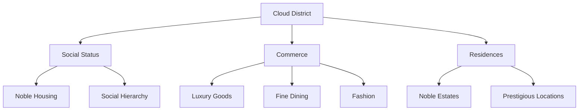

---
tags:
  - location
  - district
  - cloud_district
  - etorolth
  - nobility
aliases:
  - The Clouds
  - Noble Quarter
  - Upper District
type: district
location: Etorolth
date: 2024-12-25
---

# The Cloud District

Second only to the Canopy in prestige, the Cloud District stands as a testament to refinement and privilege within the Great Tree of Etorolth. While its name serves as fodder for jest among those dwelling in the lower reaches of the tree, the district's reputation for excellence and luxury is well-earned, making it the preferred residence of the city's nobility.

## District Character

The Cloud District embodies the aspirations of Etorolth's social elite, though its very name has become something of an ironic reference point for those dwelling in the lower districts. This duality of perception - earnest admiration from its residents and gentle mockery from below - speaks to the distinct social stratification within the Great Tree's society.

## Social Significance

The district serves as home to the majority of Etorolth's nobility, creating an atmosphere of refinement and privilege that permeates every aspect of daily life. This concentration of social power has made the Cloud District synonymous with status and achievement within the city's hierarchy, second only to the Canopy itself in terms of prestige.

## Commercial Excellence

The Cloud District maintains its reputation through the quality of its offerings:

### Luxury Goods
The finest items available in Etorolth can be found within the district's shops, catering to the discriminating tastes of its wealthy residents.

### Fashion and Attire
The district houses the city's most prestigious clothing establishments, where the latest styles and finest materials combine to create garments worthy of noble wardrobes.

### Culinary Offerings
Exceptional food establishments populate the district, serving cuisine that matches the refined palates of its residents.

## District Position

Within the Great Tree's vertical social hierarchy, the Cloud District's elevated position mirrors the status of its inhabitants. Its placement, just below the Canopy, serves as a physical manifestation of its residents' social standing within Etorolth's society.

---

*Note: The Cloud District represents both the physical and social heights of Etorolth's society, where excellence in goods and services meets the demands of the city's most privileged residents.*