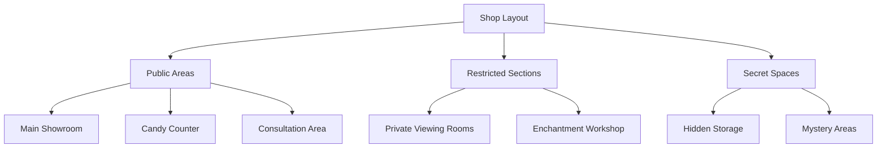
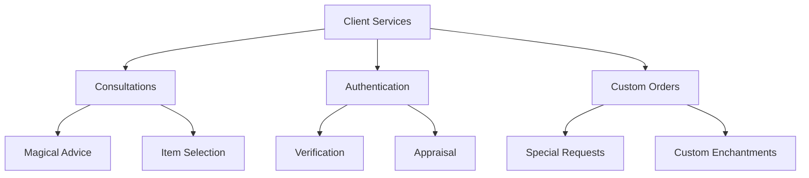

# Kattalina's Magical Mysteries

## Synopsis
Kattalina's Magical Mysteries stands as one of the Cloud District's most intriguing establishments, combining prestigious magical commerce with an unexplained confectionery element. The shop's dual nature has generated endless speculation among Eterolth's elite, while its proprietor maintains an air of elegant mystery around her unique business model.

## Quick Navigation
- [[#The Proprietor]]
- [[#Shop Layout]]
- [[#Merchandise Categories]]
- [[#Business Operations]]
- [[#Policies and Procedures]]
- [[#Mysteries and Speculation]]

## The Proprietor

> [!note] Kattalina
> A figure of fascination in Cloud District society, known for:
> - Extensive magical knowledge
> - Impeccable business acumen
> - Mysterious background
> - Elegant demeanor
> - Selective clientele
> - Unexplained confectionery expertise

## Shop Layout and Atmosphere

### Physical Description
The establishment occupies a prestigious location featuring:
- Elegant exterior design
- Mystically enhanced security
- Discrete entrance
- Multiple private rooms
- Hidden storage areas
- Enchanted displays

## Merchandise Categories

### Magical Items Collection

> [!important] Magical Inventory
> The shop's primary focus includes:
> - Enchanted artifacts of various powers
> - Practical magical tools and implements
> - Arcane accessories and enhancements
> - Mystical devices and instruments
> - Custom-crafted magical items
> - Rare and unique enchantments

### Curated Trinkets

The shop maintains a selective collection of:
- Unusual magical curiosities
- Rare collector's items
- Strange arcane devices
- Mysterious artifacts
- Unique magical oddities

### The Mysterious Candy Counter

> [!warning] Speculation Discouraged
> This peculiar feature generates constant curiosity:
> - Diverse confectionery selection
> - Unexplained magical properties
> - Unknown source and nature
> - Consistent yet mysterious stock
> - No questions answered about origin
> - Selective availability

## Business Operations

### Client Services

### Standard Procedures
The establishment maintains strict protocols:
- Appointment-only service
- Thorough item authentication
- Discrete transactions
- Custom order processes
- Professional consultations

## Security Measures

The shop employs multiple layers of protection:
- Magical wards
- Physical security
- Access restrictions
- Identity verification
- Privacy enchantments

## Client Relations

### Service Guidelines
- Professional consultation available
- Discrete handling of all transactions
- Custom orders considered
- Special requests evaluated
- Emergency services for select clients

### Shop Policies
Strict adherence to:
- No candy counter inquiries
- Magical item warranties
- Testing protocols
- Consultation requirements
- Order processing procedures

## Mysteries and Speculation

The establishment generates ongoing discussion about:

### Candy Counter Theories
- Magical enhancement possibilities
- Connection to enchantments
- Secret ingredient speculation
- Hidden purposes
- Unknown origins

### Business Model Mysteries
- Unusual combination of goods
- Selective client acceptance
- Unexplained practices
- Secret suppliers
- Hidden connections

## Future Prospects

The establishment continues to:
- Maintain its mysterious nature
- Expand magical offerings
- Preserve candy counter intrigue
- Enhance security measures
- Develop client services

---

*Note: Kattalina's Magical Mysteries embodies the elegant mystique of the Cloud District, where magical commerce meets unexplained confectionery in ways that continue to fascinate and puzzle Eterolth's elite society.*