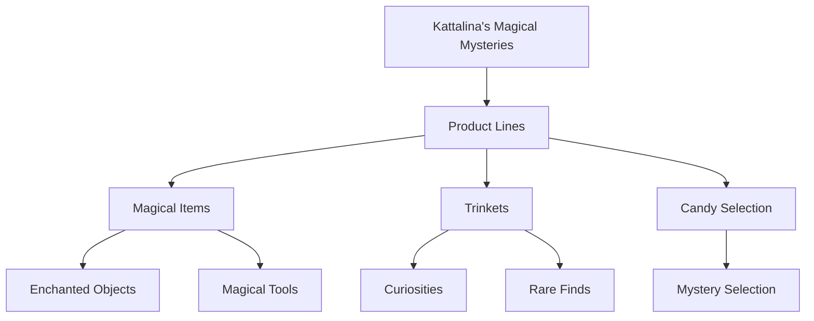

---
tags:
  - location
  - shop
  - magic_items
  - cloud_district
  - etorolth
  - candy
  - trinkets
aliases:
  - Kattalina's Magical Emporium
  - The Sweet Enchantment
  - Cloud District Magic Shop
type: establishment
location: Cloud District
specialty: Magic Items & Confectionery
owner: Kattalina
date: 2024-12-22
---

# Kattalina's Magical Mysteries

Nestled within the prestigious Cloud District, Kattalina's Magical Mysteries presents an intriguing fusion of arcane merchandise and confectionery delights. The establishment's unique combination of magical items and sweets has become a subject of much speculation among its clientele, though the owner maintains a deliberate silence on the connection between these seemingly disparate offerings.

## Proprietor

Kattalina, the enigmatic owner, manages her establishment with a curious blend of professional expertise in magical artifacts and an unexplained enthusiasm for confectionery. Her knowledge of magical items is as comprehensive as her silence about the shop's candy selection is absolute.

## Merchandise Categories

### Magical Items

The shop maintains a diverse inventory of magical merchandise:

- Enchanted artifacts
- Mystical tools
- Arcane implements
- Magical accessories
- Enchanted practical items

### Trinkets Collection

A carefully curated selection of unique items:

- Peculiar curios
- Rare collectibles
- Magical oddities
- Strange artifacts
- Mysterious devices

### The Infamous Candy Counter

Despite numerous inquiries, this peculiar addition to the magical shop remains a mystery:

- Variety of confections
- Unexplained presence
- Subject of local speculation
- Consistent stock
- Unknown sourcing

## Customer Service

For assistance within the shop:

- Direct inquiries to Kattalina
- Contact available staff
- Special orders accepted
- Custom enchantments considered
- Consultation services offered

## Shop Policies

Important guidelines for patrons:

- No questioning about the candy selection
- Magical items sold as-is
- Testing available for certain items
- Consultation required for powerful artifacts
- Custom orders require advance notice

## Notable Features

The establishment distinguishes itself through:

- Unique inventory combination
- Expert magical knowledge
- Mysterious candy selection
- Professional service
- Cloud District location

## Business Operations

Standard practices include:

- Professional magical consultation
- Item authentication
- Magical maintenance
- Special order processing
- Discrete transactions

---