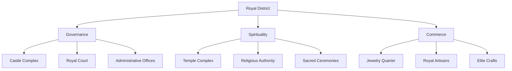
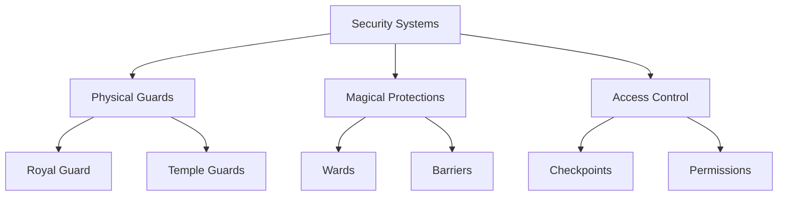

# The Royal District

## Synopsis
The Royal District crowns the Great Tree of Eterolth, representing the absolute pinnacle of both physical elevation and societal authority. Here, the seamless integration of natural majesty with architectural mastery creates a space where temporal power and spiritual authority converge, embodying the highest aspirations of Eterolth's civilization.

## Quick Navigation
- [[#Castle of Eterolth]]
- [[#Temple Complex]]
- [[#Jewelry Quarter]]
- [[#District Character]]
- [[#Security Measures]]
- [[#Daily Operations]]

## District Overview

## Castle of Eterolth

> [!important] Royal Seat
> The castle exemplifies the harmony between:
> - Natural tree growth
> - Architectural excellence
> - Magical enhancement
> - Defensive capability
> - Ceremonial function
> - Administrative necessity

### Architectural Marvel
The castle's design demonstrates:
- Integration with living tree structure
- Enhanced natural growth patterns
- Magical reinforcement
- Defensive considerations
- Ceremonial spaces
- Administrative facilities

### Royal Residence
Areas within the castle include:
- Private royal quarters
- State reception rooms
- Council chambers
- Diplomatic spaces
- Guardian posts
- Service areas

## Temple Complex

> [!note] Spiritual Center
> The temple serves multiple sacred functions:
> - Religious ceremonies
> - Spiritual guidance
> - Divine communion
> - Sacred learning
> - Ritual observance
> - Cultural preservation

### Religious Authority
The temple hierarchy maintains:
- Sacred traditions
- Spiritual guidance
- Ceremonial schedule
- Religious education
- Divine communication
- Cultural preservation

### Temple Activities
Daily operations include:
- Regular ceremonies
- Prayer sessions
- Spiritual counseling
- Sacred studies
- Ritual preparations
- Community services

## Jewelry Quarter

The district's artisanal center features:

### Master Craftsmen
- Royal jewelers
- Elite artisans
- Precious metalworkers
- Gem specialists
- Custom designers
- Heritage preservers

### Production Facilities
- Private workshops
- Secure vaults
- Design studios
- Display rooms
- Consultation spaces
- Material storage

## District Security

### Access Control
The district maintains strict security through:
- Multiple checkpoints
- Identity verification
- Purpose validation
- Time restrictions
- Escort requirements
- Emergency protocols

## Daily Operations

### Ceremonial Schedule
The district operates on a precise schedule of:
- Royal audiences
- Temple ceremonies
- Court sessions
- Diplomatic meetings
- Religious observances
- Administrative duties

### Support Services
Behind the scenes activities include:
- Royal household management
- Temple maintenance
- Security patrols
- Artisan operations
- Diplomatic preparations
- Service coordination

## Social Impact

The district's influence extends through:
- Royal proclamations
- Religious guidance
- Cultural standards
- Artistic excellence
- Political authority
- Spiritual leadership

## Relationship with Other Districts

The Royal District maintains careful oversight of:
- The Clouds (noble affairs)
- The Spine (military matters)
- Entertainment District (cultural events)
- Undergrowth (resource management)
- All districts (general governance)

## Access and Protocol

> [!warning] Access Requirements
> Entry to the district requires:
> - Proper authorization
> - Specific purpose
> - Scheduled appointment
> - Appropriate attire
> - Ceremonial observance
> - Protocol adherence

## Historical Significance

The district represents:
- Governmental continuity
- Spiritual tradition
- Cultural heritage
- Architectural achievement
- Social hierarchy
- Power structure

## Future Considerations

Plans include:
- Enhanced security measures
- Ceremonial space expansion
- Diplomatic facility improvements
- Temple complex renovation
- Artisan workshop development
- Infrastructure maintenance

---

*Note: The Royal District embodies the absolute pinnacle of Eterolth's achievement, where natural wonder, human aspiration, and divine purpose converge at the crown of the Great Tree.*