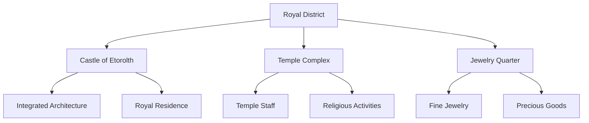

---
tags:
  - location
  - district
  - royal_district
  - etorolth
  - canopy
  - castle
  - temple
aliases:
  - The Canopy
  - Royal Quarter
  - Castle District
type: district
location: Etorolth
date: 2024-12-25
---

# The Royal District

At the very crown of the Great Tree lies the Royal District, where the Castle of Etorolth stands as a testament to the seamless integration of natural grandeur and architectural mastery. This district, built into the uppermost reaches of the ancient tree, represents the pinnacle of both physical elevation and social authority within Etorolth's society.

## Castle of Etorolth

The castle represents a remarkable achievement in architectural design, where the natural growth of the Great Tree has been carefully incorporated into the royal residence. The structure does not simply rest upon the tree but exists in harmony with it, demonstrating the deep connection between Etorolth's rulers and the ancient tree that houses them.

## District Character

The atmosphere of the Royal District is marked by a distinct air of reverence and ceremony. The regular presence of temple attendants in their ceremonial robes creates a constant reminder of the district's spiritual significance alongside its temporal authority. These robed figures have become such a common sight that they define much of the district's daily character.

## Notable Features

### Temple Complex
The temple stands as one of the district's primary destinations, drawing visitors from throughout Etorolth and beyond. Its presence in the Royal District speaks to the intertwined nature of spiritual and temporal authority within Etorolth's governance structure.

### Jewelry Quarter
The district houses the city's finest jewelers, making it a destination for those seeking precious adornments. This concentration of fine jewelry crafting adds to the district's prestigious character, providing goods worthy of its elevated status.

## Social Significance

The Royal District's position at the very top of the Great Tree serves as a physical manifestation of its social and political importance. Its limited accessibility and the particular nature of its attractions - primarily the temple and jewelry establishments - creates a natural limitation on casual visitors, maintaining an atmosphere of exclusivity and ceremonial significance.

## Daily Life

The district's daily rhythm is largely defined by the movements of temple personnel, whose robed figures create a constant reminder of the area's sacred character. Their presence, combined with the occasional seekers of fine jewelry and those conducting official business, creates a unique atmosphere that sets this district apart from the more commercially focused areas below.

---

*Note: The Royal District stands as the physical and symbolic crown of Etorolth, where temporal power, spiritual authority, and artistic excellence converge at the very peak of the Great Tree.*