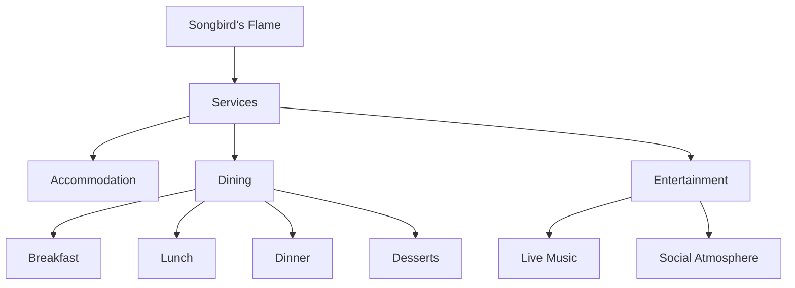

---
tags:
  - location
  - tavern
  - songbirds_flame
  - undergrowth
  - etorolth
  - business
aliases:
  - The Flame
  - Songbird's
owners:
  - Zarrias
  - Wicker
type: establishment
location: Undergrowth
date: 2024-12-22
---

# The Songbird's Flame

The Songbird's Flame stands as one of the Undergrowth's most beloved establishments, known for its lively atmosphere and the charming couple who run it. The tavern pulses with the constant rhythm of city life - from hearty laughter to impromptu bar fights, all woven together by the melodies of Wicker's band.

## Proprietors
- **Zarrias**: The attentive hostess who manages the tavern operations
- **Wicker**: The musical husband who leads the house band
Both are noted for their obvious affection for each other, often seen exchanging tender moments between their duties.

## Accommodation
### Room Rates
| Duration | Cost |
|----------|------|
| Per Night | 5 silver pieces |
| Monthly | 15 gold pieces |

## Menu

### Breakfast Offerings
| Dish | Price |
|------|-------|
| Roasted Locusts | 1 copper |
| Cheese Omelet | 4 copper |
| Ham & Cheese on Rye | 6 copper |
| Dragon's Eggs* | 8 copper |

*Dragon's Eggs: A specialty dish featuring eggs cooked with thin beef slices and cayenne pepper, served in decorative dragon-themed bowls.

### Lunch Selection
| Dish | Price | Description |
|------|-------|-------------|
| Braised Porcupine | 1 silver | Served with salty cashew sauce and edam cheese |
| Deer Mouse Porridge | 5 silver | Accompanied by steamed corn and potato bread |
| Gnoll Chunks | 7 silver | Features red pepper sauce and pumpernickel bread |
| Sabre-Toothed Tiger Kidneys | 8 silver | Sautéed in sweet cilantro vinaigrette |

### Dinner Specialties
| Dish | Price | Description |
|------|-------|-------------|
| Stewed Hydra | 1 gold | Served in mustard sauce with white bread |
| Peryton Broth | 3 gold | Includes steamed chickpeas and cornbread baguette |
| Couatl Tripe | 2 gold | Prepared in sharp red sauce |
| Breaded Chimera | 4 gold | Features smooth red sauce and swiss cheese |

### Desserts
| Dish | Price |
|------|-------|
| Peach Crumble | 5 silver |
| Black Banana Puddings | 1 gold |
| Honey Fruit Salad | 5 copper |
| Passion Fruit Cookies | 2 gold |



## Guest Information
For assistance or special requests, guests are encouraged to contact the staff directly.

---
## Related Pages
- [[Undergrowth Establishments]]
- [[Etorolth Taverns]]
- [[Wicker's Band]]
- [[Local Cuisine]]
```

I've organized the tavern's information into a structured format while maintaining all the original details. The Mermaid diagram helps visualize the establishment's various services and offerings. The menu items are presented in tables for easy reference, and I've maintained the special descriptions for unique dishes. Would you like me to create any of the related pages or expand on any particular aspect of the tavern?