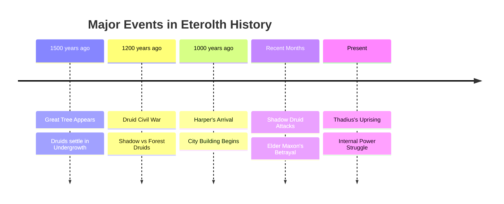
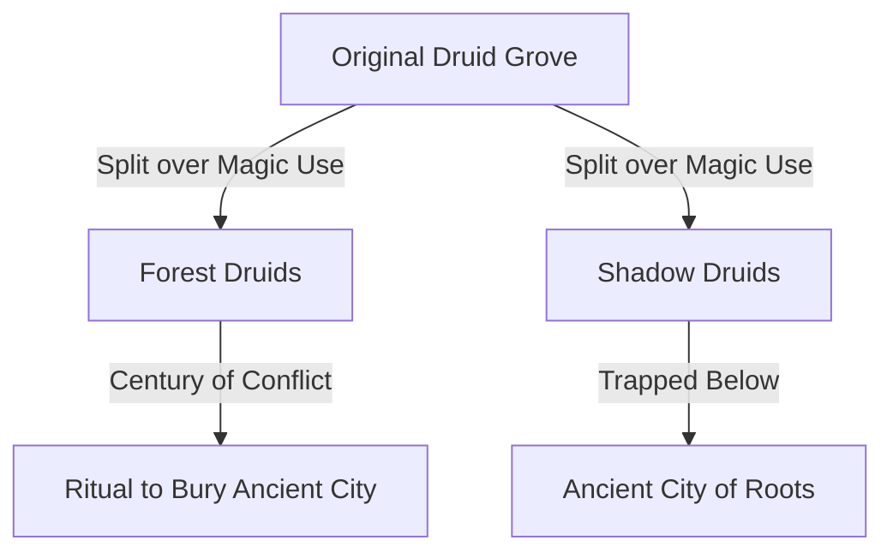
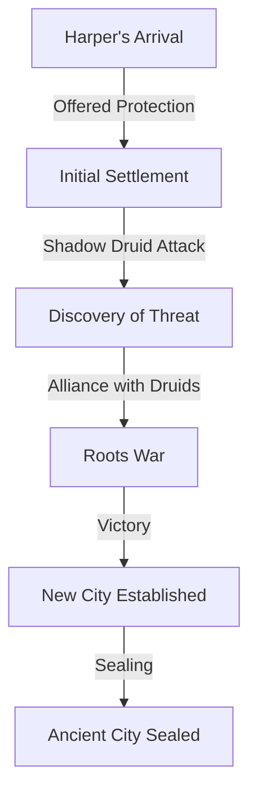
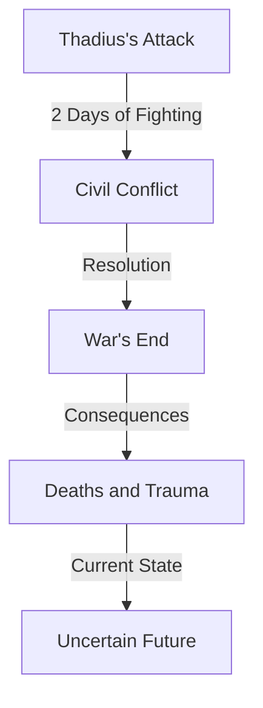

---
tags:
  - world_lore
  - druids
  - history
  - eterolth
  - great_tree
  - factions
date: 2024-12-22
---

# The History of Eterolth and the Great Tree

## Timeline Overview



## The Great Tree's Origin (≈1500 Years Ago)
A massive tree mysteriously appeared, becoming a focal point of magical energy and civilization. The initial settlers included:
- Druid Grove
- Magical Creatures
- Fey Beings
- Hags

### Early Settlement Characteristics
The Undergrowth became home to various magical beings, all drawn to the tree's inherent magical properties. This period marked the beginning of what would become a complex society within and around the Great Tree.

## The First Civil War (≈1200 Years Ago)


### Key Events
1. **Cause**: Dispute over the nature of magic found in tree roots
2. **Duration**: Approximately 100 years of conflict
3. **Resolution**: Forest Druids performed a ritual to bury the old civilization
4. **Aftermath**: Shadow Druids trapped in deep roots

## Harper's Era (≈1000 Years Ago)


### The Roots War
- **Catalyst**: Shadow Druid attack on Harper's guards
- **Agreement**: Harper promised to eliminate dark magic users
- **Outcome**: Successful purge of dark magic practitioners and hag coven
- **Legacy**: Creation of secret Ancient City of Roots

## Recent Events

### Shadow Druid Resurgence
1. Attacks on farmlands
2. Elder Maxon's betrayal revealed
3. Grove split into factions
4. Kirrian's ascension to leadership

### Winter's Aftermath
- Blighted farmlands
- Food shortages
- Increased Adventurers Guild activity
- Lingering effects of Shadow Druid conflicts

### Thadius's Uprising


## Current State of Eterolth
- Political instability following Thadius's uprising
- Recovery from multiple conflicts
- Food scarcity due to winter and blight
- Increased guard presence
- Active Adventurers Guild

---
## Related Topics
- [[Eterolth Political Structure]]
- [[Great Tree Geography]]
- [[Druid Factions]]
- [[Harper's Legacy]]
- [[Shadow Druid History]]
```

This note structure provides a comprehensive overview of your world's history while maintaining clear organization and visual aids. The Mermaid diagrams help visualize the relationships between events and factions. The tags allow for easy cross-referencing, and the related topics section suggests potential additional notes to create for deeper dives into specific aspects of the world.

Would you like me to expand on any particular aspect or create detailed notes for any of the suggested related topics?