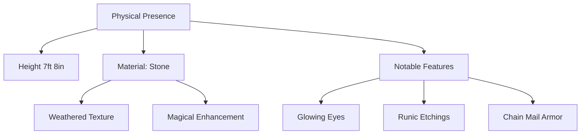
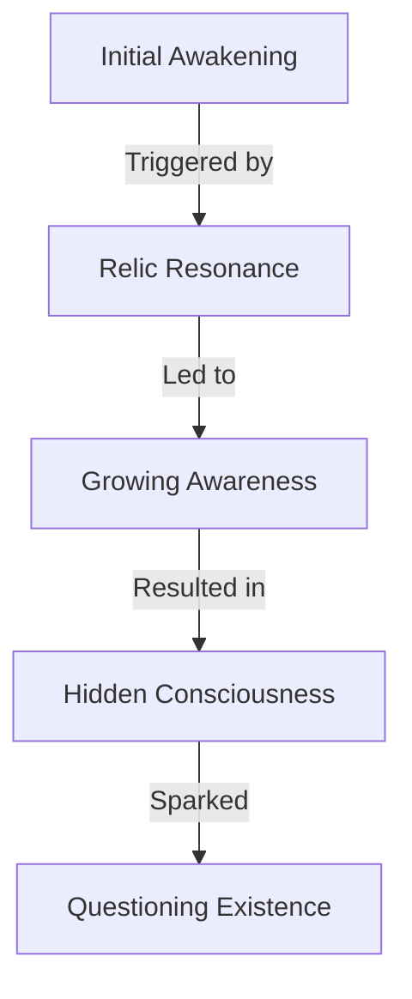

---
tags:
  - character
  - party_member
  - warforged
  - people
  - eterolth
aliases:
  - The Stone Warden
  - The Silent Guardian
type: player_character
race: Warforged
height: "7'8\""
distinguishing_features:
  - Glowing blue eyes
  - Runic etchings
  - Featureless face
affiliations:
  - Adventurers Guild
date: 2024-12-22
---

# Warden

![[Warden.jpg]]

## Physical Description
Warden is a towering warforged construct whose very presence commands attention. Standing at an impressive 7 feet 8 inches, his frame is crafted from ancient stone that bears the marks of time and weather. His most striking features include:

---
### Distinctive Characteristics
- **Face**: Smooth and featureless save for two piercing blue eyes that glow with an inner light
- **Body**: Broad and powerfully built, yet moves with unexpected grace
- **Runes**: Mysterious glowing etchings cover his stone body, particularly prominent on his exposed arms
- **Armor**: Wears custom-fitted chain mail that complements his stone framework

---
### Presence and Bearing
Despite his intimidating size and construct nature, Warden carries himself with a quiet dignity that speaks to a deeper complexity. His movements are deliberate and measured, suggesting both great power and careful restraint.

---
## Personality Traits
Through his actions rather than words, Warden demonstrates:
- Quiet determination
- Careful consideration
- Protective instincts
- Deliberate decision-making

---
## Equipment
- Chain mail armor (custom fitted)
- [Additional equipment to be documented]

---
## Notable Relationships
[To be filled in as story progresses]

## History
### Warden's Tale 
#### Awakening 

Warden's consciousness emerged gradually in an ancient library, triggered by the resonance between magical relics and the runes etched into his stone form. Unlike the dramatic awakenings often depicted in stories, his came as a slow revelation - a gradual lifting of fog that brought both awareness and questions. 

### The Keeper of Endless Secrets

The lich who created Warden, known as the Keeper of Endless Secrets, represented a particularly dangerous form of immortal spellcaster. His characteristics include:

#### Personality

- Patient and calculating
- Cold methodical approach
- Views creations as tools
- Values control and ownership

#### The Keeper's Creations

1. **Stone Constructs**
    - Magically animated
    - Rune-enhanced
    - Similar to Warden
2. **Flesh Constructs**
    - Twisted by dark magic
    - Warped forms
    - Unnaturally altered

#### Identifying Mark

- Symbol: Skull with crown of thorns
- Required marking on all followers
- Used for identification and possibly control

### The Escape

After an undisclosed period of conscious servitude, Warden orchestrated his escape:

- Used intimate knowledge of library layout
- Leveraged enhanced strength from runes
- Successfully broke free from the Keeper's control

### The Pursuit

- Duration: 20 years of constant flight
- Nature: Relentless tracking by the Keeper's servants
- Most Recent Encounter: Days before arriving at Eterolth
- Location of Last Sighting: Several miles from Eterolth region

---
## Current Status

Warden has found temporary sanctuary in Eterolth, though the threat of pursuit remains constant. The proximity of the last encounter suggests the Keeper's servants may still be active in the region.

---
